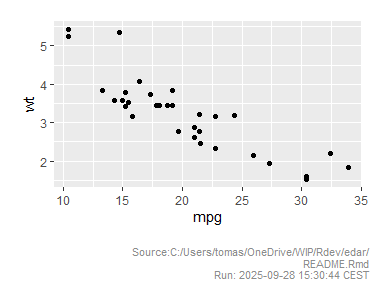

<!-- README.md is generated from README.Rmd. Please edit that file -->

# edar

<!-- badges: start -->

[](https://github.com/soutomas/edar/actions/workflows/R-CMD-check.yaml)
[](https://app.codecov.io/gh/soutomas/edar)
<!-- badges: end -->

The goal of edar is to provide some convenient functions for common
tasks in exploratory data analysis.

## Citation

Sou T (2025). *edar: Convenient Functions for Exploratory Data
Analysis*. R package version 0.0.1, <https://github.com/soutomas/edar>.

``` r
citation("edar")
#> To cite package 'edar' in publications use:
#> 
#>   Sou T (2025). _edar: Convenient Functions for Exploratory Data
#>   Analysis_. R package version 0.0.1,
#>   <https://github.com/soutomas/edar>.
#> 
#> A BibTeX entry for LaTeX users is
#> 
#>   @Manual{,
#>     title = {edar: Convenient Functions for Exploratory Data Analysis},
#>     author = {Tomas Sou},
#>     year = {2025},
#>     note = {R package version 0.0.1},
#>     url = {https://github.com/soutomas/edar},
#>   }
```

## Installation

You can install the development version of edar from
[GitHub](https://github.com/) with:

``` r
# install.packages("pak")
pak::pak("soutomas/edar")
```

## Example

Commonly, we want to add a label indicating the source file in the
output.

``` r
library(edar)
lab1 = label_src(1)
lab1
#> [1] "Source:C:/Users/tomas/OneDrive/WIP/Rdev/edar/README.Rmd\nRun: 2025-09-29 00:29:04 CEST"
```

The source label can be directly added to a ggplot object.

``` r
library(ggplot2)
#> Warning: package 'ggplot2' was built under R version 4.4.3
p = ggplot(mtcars, aes(mpg, wt)) +
  geom_point() 
p |> ggsrc()
```



Summary of continuous and categorical variables.

``` r
library(dplyr)
#> Warning: package 'dplyr' was built under R version 4.4.3
#> 
#> Attaching package: 'dplyr'
#> The following objects are masked from 'package:stats':
#> 
#>     filter, lag
#> The following objects are masked from 'package:base':
#> 
#>     intersect, setdiff, setequal, union

# Data 
dat = mtcars |> mutate(vs=factor(vs), am=factor(am))

# Summary for continuous variables in a data frame. 
dat |> summ_by()
#> Dropped: vs am
#> Adding missing grouping variables: `name`
#> # A tibble: 9 × 10
#>   name      n   nNA   Mean    Med      SD   Min   P10    P90    Max
#>   <chr> <int> <int>  <dbl>  <dbl>   <dbl> <dbl> <dbl>  <dbl>  <dbl>
#> 1 carb     32     0   2.81   2      1.62   1     1      4      8   
#> 2 cyl      32     0   6.19   6      1.79   4     4      8      8   
#> 3 disp     32     0 231.   196.   124.    71.1  80.6  396    472   
#> 4 drat     32     0   3.60   3.70   0.535  2.76  3.01   4.21   4.93
#> 5 gear     32     0   3.69   4      0.738  3     3      5      5   
#> 6 hp       32     0 147.   123     68.6   52    66    244.   335   
#> 7 mpg      32     0  20.1   19.2    6.03  10.4  14.3   30.1   33.9 
#> 8 qsec     32     0  17.8   17.7    1.79  14.5  15.5   20.0   22.9 
#> 9 wt       32     0   3.22   3.32   0.978  1.51  1.96   4.05   5.42

# Summary of selected variable after grouping. 
dat |> summ_by("mpg",vs)
#> Adding missing grouping variables: `vs`
#> # A tibble: 2 × 10
#>   vs        n   nNA  Mean   Med    SD   Min   P10   P90   Max
#>   <fct> <int> <int> <dbl> <dbl> <dbl> <dbl> <dbl> <dbl> <dbl>
#> 1 0        18     0  16.6  15.6  3.86  10.4  12.4  21    26  
#> 2 1        14     0  24.6  22.8  5.38  17.8  18.4  31.8  33.9
dat |> summ_by("mpg",vs,am)
#> Adding missing grouping variables: `vs`, `am`
#> # A tibble: 4 × 11
#> # Groups:   vs [2]
#>   vs    am        n   nNA  Mean   Med    SD   Min   P10   P90   Max
#>   <fct> <fct> <int> <int> <dbl> <dbl> <dbl> <dbl> <dbl> <dbl> <dbl>
#> 1 0     0        12     0  15.0  15.2  2.77  10.4  10.7  18.6  19.2
#> 2 0     1         6     0  19.8  20.4  4.01  15    15.4  23.5  26  
#> 3 1     0         7     0  20.7  21.4  2.47  17.8  18.0  23.4  24.4
#> 4 1     1         7     0  28.4  30.4  4.76  21.4  22.2  33    33.9

# Summary for categorical variables in a data frame. 
dat |> summ_cat()
#> Dropped: mpg cyl disp hp drat wt qsec gear carb
#> $vs
#>  vs  n percent
#>   0 18  0.5625
#>   1 14  0.4375
#> 
#> $am
#>  am  n percent
#>   0 19 0.59375
#>   1 13 0.40625

# Summary for selected categorical variable. 
dat |> summ_cat("vs")
#> Dropped: mpg cyl disp hp drat wt qsec gear carb
#>  vs  n percent
#>   0 18  0.5625
#>   1 14  0.4375
```

Results can be directly viewed in a flextable object easily.

``` r
# Show data frame in a flextable object. 
dat |> summ_by("mpg",vs) |> ft()
#> Adding missing grouping variables: `vs`
```


``` r

# Source label can be easily added. 
dat |> summ_cat("am") |> ft(src=1)
#> Dropped: mpg cyl disp hp drat wt qsec gear carb
```


<!-- What is special about using `README.Rmd` instead of just `README.md`? You can include R chunks like so: -->

<!-- ```{r cars} -->

<!-- summary(cars) -->

<!-- ``` -->

<!-- You'll still need to render `README.Rmd` regularly, to keep `README.md` up-to-date. `devtools::build_readme()` is handy for this. -->

<!-- You can also embed plots, for example: -->

<!-- ```{r pressure, echo = FALSE} -->

<!-- plot(pressure) -->

<!-- ``` -->

<!-- In that case, don't forget to commit and push the resulting figure files, so they display on GitHub and CRAN. -->
