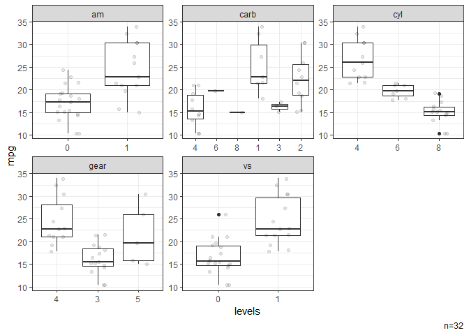
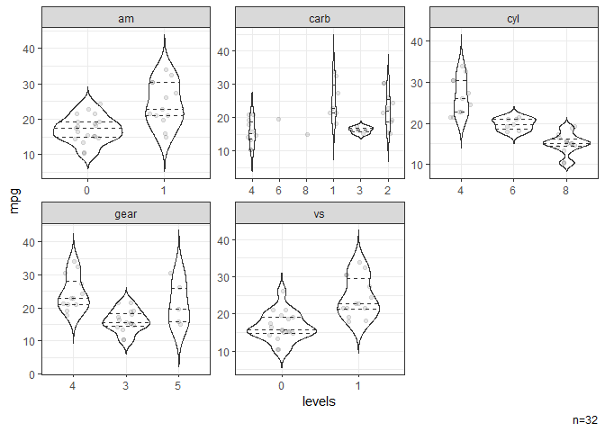

# edar

The goal of edar is to provide some convenient functions to facilitate
common tasks in exploratory data analysis.

## Citation

Sou T (2025). *edar: Convenient Functions for Exploratory Data
Analysis*. R package version 0.0.5.9000,
<https://github.com/soutomas/edar>.

``` r
citation("edar")
#> Warning in citation("edar"): could not determine year for 'edar' from package
#> DESCRIPTION file
#> To cite package 'edar' in publications use:
#> 
#>   Sou T (2025). _edar: Convenient Functions for Exploratory Data
#>   Analysis_. R package version 0.0.5.9000,
#>   https://github.com/soutomas/edar/,
#>   <https://soutomas.github.io/edar/>.
#> 
#> A BibTeX entry for LaTeX users is
#> 
#>   @Manual{,
#>     title = {edar: Convenient Functions for Exploratory Data Analysis},
#>     author = {Tomas Sou},
#>     note = {R package version 0.0.5.9000, 
#> https://github.com/soutomas/edar/},
#>     url = {https://soutomas.github.io/edar/},
#>   }
```

## Installation

``` r
# From CRAN 
install.packages("edar")

# From GitHub - for the development version
# install.packages("pak")
pak::pak("soutomas/edar")
```

## Example

### Summary

It is often helpful to see a quick summary of the dataset.

``` r
library(edar)

# Data 
dat = mtcars |> dplyr::mutate(across(c(am,carb,cyl,gear,vs),factor))

# Summaries of all continuous variables in a data frame. 
dat |> summ_by()
#> NB: Non-numeric variables are dropped.
#> Dropped: cyl vs am gear carb
#> Adding missing grouping variables: `name`
#> # A tibble: 6 × 10
#>   name      n   nNA   Mean      SD   Min    P25    Med    P75    Max
#>   <chr> <int> <int>  <dbl>   <dbl> <dbl>  <dbl>  <dbl>  <dbl>  <dbl>
#> 1 disp     32     0 231.   124.    71.1  121.   196.   326    472   
#> 2 drat     32     0   3.60   0.535  2.76   3.08   3.70   3.92   4.93
#> 3 hp       32     0 147.    68.6   52     96.5  123    180    335   
#> 4 mpg      32     0  20.1    6.03  10.4   15.4   19.2   22.8   33.9 
#> 5 qsec     32     0  17.8    1.79  14.5   16.9   17.7   18.9   22.9 
#> 6 wt       32     0   3.22   0.978  1.51   2.58   3.32   3.61   5.42

# Summaries of a selected variable after grouping. 
dat |> summ_by(mpg,vs)
#> Adding missing grouping variables: `vs`
#> # A tibble: 2 × 10
#>   vs        n   nNA  Mean    SD   Min   P25   Med   P75   Max
#>   <fct> <int> <int> <dbl> <dbl> <dbl> <dbl> <dbl> <dbl> <dbl>
#> 1 0        18     0  16.6  3.86  10.4  14.8  15.6  19.1  26  
#> 2 1        14     0  24.6  5.38  17.8  21.4  22.8  29.6  33.9

# Summaries of all categorical variables in a data frame. 
dat |> summ_cat()
#> NB: Numeric variables are dropped.
#> Dropped: mpg disp hp drat wt qsec
#> $cyl
#>    cyl  n percent
#>      4 11 0.34375
#>      6  7 0.21875
#>      8 14 0.43750
#>  Total 32 1.00000
#> 
#> $vs
#>     vs  n percent
#>      0 18  0.5625
#>      1 14  0.4375
#>  Total 32  1.0000
#> 
#> $am
#>     am  n percent
#>      0 19 0.59375
#>      1 13 0.40625
#>  Total 32 1.00000
#> 
#> $gear
#>   gear  n percent
#>      3 15 0.46875
#>      4 12 0.37500
#>      5  5 0.15625
#>  Total 32 1.00000
#> 
#> $carb
#>   carb  n percent
#>      1  7 0.21875
#>      2 10 0.31250
#>      3  3 0.09375
#>      4 10 0.31250
#>      6  1 0.03125
#>      8  1 0.03125
#>  Total 32 1.00000
```

### Visualisation

Distributions of variables can be quickly visualised for exploratory
graphical analysis.

``` r
library(ggplot2)
#> Warning: package 'ggplot2' was built under R version 4.4.3
set_theme(theme_bw())

# Histograms of all continuous variables in a dataset. 
dat |> gghist()
#> NB: Non-numeric variables are dropped.
#> Dropped: cyl vs am gear carb
```


``` r

# Box plots of a selected variable by all categorical variables in a dataset. 
dat |> ggbox(mpg)
#> NB: Numeric variables are dropped.
#> Dropped: disp hp drat wt qsec
```



``` r

# Violin plots of a selected variable by all categorical variables in a dataset. 
dat |> ggvio(mpg)
#> NB: Numeric variables are dropped.
#> Dropped: disp hp drat wt qsec
#> Warning: Groups with fewer than two datapoints have been dropped.
#> ℹ Set `drop = FALSE` to consider such groups for position adjustment purposes.
#> Warning: Groups with fewer than two datapoints have been dropped.
#> ℹ Set `drop = FALSE` to consider such groups for position adjustment purposes.
```



### Tables

Tables can be viewed directly in a flextable object.

``` r
# Show data frame in a flextable object. 
dat |> summ_by(mpg,vs) |> ft()
#> Adding missing grouping variables: `vs`
```


### Labels

A label indicating the current source file with a time stamp can be
easily generated for annotation.

``` r
# To generate a source file label for annotation 
lab = label_src()
```

``` r
# A source file label can be directly added to the flextable output. 
dat |> summ_by(mpg,vs) |> ft(src=1)
```

``` r
# A source file label can be directly added to a ggplot object. 
p = ggplot(mtcars, aes(mpg, wt)) + geom_point() 
p |> ggsrc()
```
